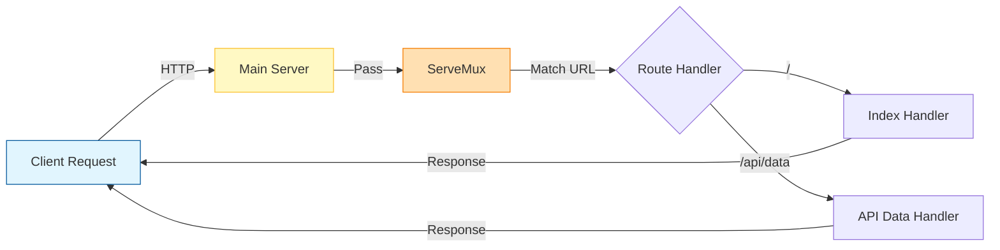

# Go Journey

Welcome to my Go programming repository. This "book" documents my journey of learning Go (Golang) through practical projects. Each chapter dives into a specific project, explaining the concepts, code, and logic behind it.

## Index

*   [**Chapter 1: Intro**](./Intro) - A basic HTTP server implementation using the standard library.

---

## Chapter 1: Intro

### Overview
The **Intro** project is a foundational exploration of Go's standard library, specifically `net/http`. Instead of reaching for heavy frameworks like Gin or Echo immediately, this project implements a simple HTTP server using Go's built-in capabilities. It demonstrates how to structure a Go application using the standard `cmd` and `internal` layout.

### Concept
This project demonstrates several core Go concepts:
1.  **Standard Library**: Using `net/http` to build a robust web server.
2.  **Multiplexing**: Using `http.ServeMux` to handle routing.
3.  **Project Layout**: Adopting the community-standard project structure:
    *   `cmd/`: Application entry points.
    *   `internal/`: Private application and library code.
4.  **Modularity**: Separating routing logic from the main application entry point.

### Data Flow
The following diagram illustrates how a request is handled by the server:



### Code Walkthrough

#### The Entry Point: `cmd/intro/main.go`

```go
func main() {
    router := routes.NewRouter()

    port := ":8080"
    addr := fmt.Sprintf("Listening on http://localhost%s", port)
    fmt.Printf(`Server started. %s`, addr)
    if err := http.ListenAndServe(port, router); err != nil {
        fmt.Printf("Failed to start server: %v", err)
    }
}
```
**Key Components**:
*   **`routes.NewRouter()`**: We delegate the creation of routing logic to an internal package.
*   **`http.ListenAndServe`**: This function starts the server. It takes the port and the handler (our router). If `router` were nil, it would use the `DefaultServeMux`.
*   **Error Handling**: Go treats errors as values. We explicitly check if `ListenAndServe` returns a non-nil error.

#### The Router: `internal/routes/routes.go`

```go
func NewRouter() *http.ServeMux {
    mux := http.NewServeMux()
    mux.HandleFunc("/", indexHandler) 
    mux.HandleFunc("/api/data", apiDataHandler)
    return mux
} 
```
**Key Definitions**:
*   **`*http.ServeMux`**: A request multiplexer. It matches the URL of each incoming request against a list of registered patterns and calls the handler for the pattern that most closely matches the URL.
*   **`HandleFunc`**: Registers a function to handle specific URL patterns.

### How to Build & Run

**Prerequisites**
*   Go installed (version 1.22+ recommended)

**Steps**

1.  **Navigate to the project directory**
    ```bash
    cd Intro
    ```

2.  **Run the application**
    You can run the Go file directly:
    ```bash
    go run cmd/intro/main.go
    ```

3.  **Test the endpoints**
    Open your browser or use `curl`:
    *   `http://localhost:8080/` - Should display the welcome message.
    *   `http://localhost:8080/api/data` - Should return sample data.

---
*Happy Coding!*
