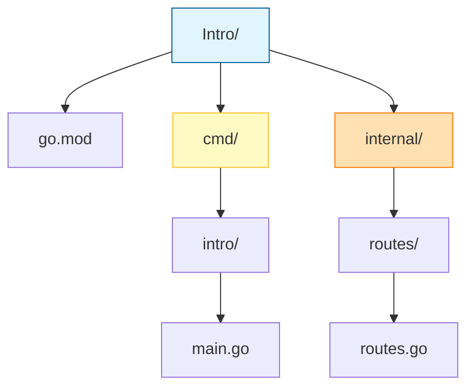
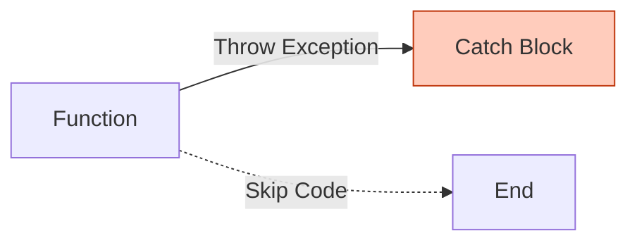
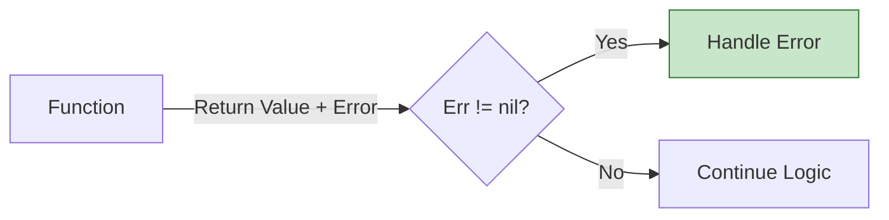

# Go Journey

Welcome to my Go programming repository. This "book" documents my journey of learning Go (Golang) through practical projects. Each chapter dives into a specific project, explaining the concepts, code, and logic behind it.

## Index

*   [**Chapter 0: Intro**](./Intro) - Standard project structure, modules, and packages.
*   [**Chapter 1: The Runtime**](#chapter-1-the-runtime) - Deep dive into Stack vs Heap, GC, sync.Pool, and Profiling.
*   [**Chapter 2: Error Handling**](./errorhandling) - Errors as values, Sentinel errors vs Custom structs.
*   [**Chapter 3: Concurrency**](./concurrency) - Goroutines, Channels, and the Worker Pool pattern.

---

## Chapter 0: Intro

### Overview
The **Intro** project is a practical guide to setting up a "proper" Go workspace. Rather than just writing a single `main.go` file, this project demonstrates the **standard project layout** preferred by the Go community. It covers how to initialize a module, organize code into packages, and structure your folders for scalability.

### Key Concepts
1.  **Go Modules (`go.mod`)**: The `go.mod` file defines the module's path and dependencies. It allows you to manage versions and imports reliably.
2.  **Standard Directory Layout**:
    *   **`cmd/`**: Contains the main entry point(s) of the application. The directory name usually matches the desired name of the executable (e.g., `cmd/intro` builds to `intro.exe`).
    *   **`internal/`**: Contains private application code. Go's toolchain enforces that code inside `internal` cannot be imported by external modules, ensuring better encapsulation.
3.  **Packages**: In Go, every folder is a package. All files within a single folder must belong to the same package.

### Folder Structure
Authentication of a clean Go project looks like this:



### Code & Structure Walkthrough

#### 1. The Module Definition (`go.mod`)
Created by running `go mod init github.com/priyanshu-samal/intro`. This file marks the root of the project and tracks the Go version (e.g., `go 1.25.5`).

#### 2. The Entry Point (`cmd/intro/main.go`)
This is the "face" of the application. It belongs to `package main`, which tells the Go compiler that this file should compile into an executable program.
```go
package main

import (
    "github.com/priyanshu-samal/Intro/internal/routes" // Importing our internal package
)

func main() {
    router := routes.NewRouter() // Using logic from the internal package
    // ... server startup logic ...
}
```

#### 3. The Logic Package (`internal/routes/routes.go`)
This file belongs to `package routes`. By placing it in `internal/`, we clearly signal that this logic is specific to our `Intro` application.
```go
package routes // Declares the package name

func NewRouter() *http.ServeMux {
    // ... routing implementations ...
}
```

### How Wait Works
*   **Running**: When you run `go run cmd/intro/main.go`, Go compiles the `main` package and links it with the imported `routes` package.
*   **Building**: Running `go build -o bin/intro.exe ./cmd/intro` would create a binary in a `bin` folder.

---

## Chapter 1: The Runtime

### Overview
Before writing more code, it is critical to understand **how Go actually executes it**. This chapter covers the hidden mechanisms of the Go runtime: memory management, the garbage collector, and performance tuning. Understanding these concepts transforms you from writing "random Go code" to writing code that cooperates with the runtime.

### 1. Stack vs Heap (Escape Analysis)
Imagine every function in Go is a **small room**. When you create a variable, Go has to decide:
> *"Can this thing stay inside the room, or do I need to put it outside where everyone can reach it?"*

*   **Stack (The Room)**: If Go is 100% sure the variable is used *only* inside that room, it keeps it on the stack. When you leave the room (function returns), it’s gone. Fast and clean.
*   **Heap (The Outside)**: If Go is not sure—even a little bit unsure—it moves the variable to the heap so it doesn’t disappear too early.

**Escape Analysis** is Go thinking very carefully before running your program.
To see this decision process in action, run:
```bash
go build -gcflags="-m"
```
Go will literally tell you what it decided and why. If you don’t look at that output, you’re guessing.

### 2. Garbage Collector (GC)
Now imagine the **Heap** is a **playground**.
*   **Objects**: Kids running around.
*   **Garbage**: Forgotten toys lying around.

The **Garbage Collector** is a cleaning robot that walks around while kids are still playing. It checks:
> *"Is anyone still holding this toy?"*
*   **Yes** → Leave it.
*   **No** → Pick it up and throw it away.

This robot works while your program is running (concurrently), but sometimes it says *"Everyone freeze for a moment"* (Stop-The-World) to do a quick check.
**The Cost**: The robot gets tired if you keep throwing new toys on the ground every second. Lots of tiny heap allocations slow programs down, even if memory looks "free".

### 3. sync.Pool
Imagine instead of throwing toys away, you have a **shared toy box**. When a kid finishes playing with a toy, they put it back in the box instead of throwing it away. The next kid reuses it.

**sync.Pool is NOT a Cache**
A cache is like a fridge: you put food in and expect it to be there later. `sync.Pool` is a **Recycling Bin**.
*   You throw something in, maybe someone reuses it.
*   **But**: The cleaning robot (GC) is allowed to empty the bin whenever it wants.

**The Golden Rule**: Your program must behave exactly the same if the pool were always empty.
*   **Good Usage**: Temporary buffers, encoding/decoding scratch space.
*   **Bad Usage**: Database connections, user sessions, configuration.

### 4. unsafe
Normally, Go acts like a strict parent, checking types and memory to make sure you don't hurt yourself.
**unsafe** is Go saying:
> *"Fine. You know what you’re doing. I won’t stop you."*

Using `unsafe` is like giving scissors to a kid. You can do useful things (like direct memory manipulation for performance), but one wrong move can silently corrupt your program in ways you won't notice until much later.

### 5. pprof
Finally, imagine your program is a city, and it feels slow. You *think* traffic is the problem, but you're guessing.
**pprof** is a helicopter camera. It shows you:
*   Where time is *actually* being spent.
*   Where memory is *actually* being allocated.

Without pprof, performance tuning is just "vibes". With it, you can pinpoint the exact line causing 90% of the garbage.

### Summary: The Unified Theory
Go is constantly trying to keep things simple, fast, and safe:
1.  **Escape Analysis** decides where things live.
2.  **Heap Objects** create work for the GC.
3.  **sync.Pool** reduces how often garbage is created.
4.  **unsafe** lets you break rules when you must.
5.  **pprof** tells you the truth when intuition lies.

---

## Chapter 2: Error Handling

### Overview
In many languages (Java, Python, JS), errors are "exceptions" — they crash the program unless you catch them.
In Go, **Errors are Values**. They are just like `int` or `string`. You don't "throw" them; you pass them around.

This philosophy forces you to handle failure cases explicitly where they happen, rather than letting them bubble up and crash your app unexpectedly.

### Key Concepts

#### 1. Sentinel Errors (`errors.Is`)
Think of these as "Error Constants".
*   Example: `var ErrNotFound = errors.New("not found")`
*   Usage: You check for them with `==` (or better, `errors.Is`).
*   Analogy: Checking a specific return code.

#### 2. Custom Error Types (`errors.As`)
Sometimes a simple string isn't enough. You need data: "Which URL failed?", "How many retries?".
*   We define a struct that implements the `error` interface.
*   Usage: usage of `errors.As` allows us to "unwrap" the error and see the fields inside the struct.

### Flow Comparison

**Exception Model (Other Languages)**


**Go Model (Errors as Values)**


### Code Walkthrough (`errorhandling/main.go`)

**Checking for specific errors**
```go
if errors.Is(err, ErrNotFound) {
    // "Is this specific error the one we got?"
}
```

**Extracting data from errors**
```go
var connErr *ConnectionError
if errors.As(err, &connErr) {
    // "Treat this error as a ConnectionError and give me access to .URL"
    fmt.Printf("Failed URL: %s", connErr.URL)
}
```

### How to Run
```bash
cd errorhandling
go run main.go
```

---

## Chapter 3: Concurrency

### Overview
Concurrency is Go's superpower. Unlike OS threads which are heavy (1MB+ stack), Go uses **Goroutines** (2KB stack). A single Go program can easily run tens of thousands of concurrent tasks.

This chapter implements a **Worker Pool**. Instead of spawning a new goroutine for every single job (which can crash a system under load), we start a fixed number of workers that pick jobs from a queue.

### Core Components

1.  **Goroutine (`go func()`)**: A lightweight thread of execution.
2.  **Channel (`make(chan T)`)**: A pipe that connects concurrent goroutines. You send values into one end and receive from the other.
3.  **WaitGroup (`sync.WaitGroup`)**: A counter to wait for a collection of goroutines to finish.

### Design Pattern: Worker Pool (Fan-Out / Fan-In)

We use a **Fan-Out** pattern to distribute work and a **Fan-In** (or simple collection) to gather results.

```mermaid
flowchart LR
    Jobs[Job Queue (Channel)] -->|Pull| W1[Worker 1]
    Jobs -->|Pull| W2[Worker 2]
    Jobs -->|Pull| W3[Worker 3]
    
    W1 -->|Push| Results[Result Queue (Channel)]
    W2 -->|Push| Results
    W3 -->|Push| Results
    
    style Jobs fill:#e1f5fe,stroke:#01579b
    style Results fill:#e1f5fe,stroke:#01579b
    style W1 fill:#fff9c4,stroke:#fbc02d
```

### Code Walkthrough (`concurrency/main.go`)

**1. The Worker**
```go
func worker(wg *sync.WaitGroup, resultChan chan string, jobsChan chan string) {
    defer wg.Done() // Signal completion when function exits
    for url := range jobsChan { // Automatically stops when channel is closed
        // ... process job ...
        resultChan <- "Fetched " + url
    }
}
```

**2. The Orchestrator (main)**
*   **Channels**: We create buffered channels for `jobs` and `results`.
*   **Spawning**: We loop `totalWorkers` times to start the worker goroutines.
*   **Dispatching**: We push data into `jobsChan` and immediately `close` it. This tells workers "No more work coming".
*   **Waiting**: We run `wg.Wait()` in a *separate goroutine* so that the main thread can proceed to read results.

### Deep Dive: Why close `resultChan` in a goroutine?
```go
go func() {
    wg.Wait()
    close(resultChan)
}()
```
If we waited in the main thread *before* reading the results, the program might **deadlock** if the result channel fills up (since workers would be blocked trying to write to a full channel, and main is blocked waiting for workers). By waiting asynchronously, we allow `main` to start consuming results immediately.

---
*Happy Coding!*

