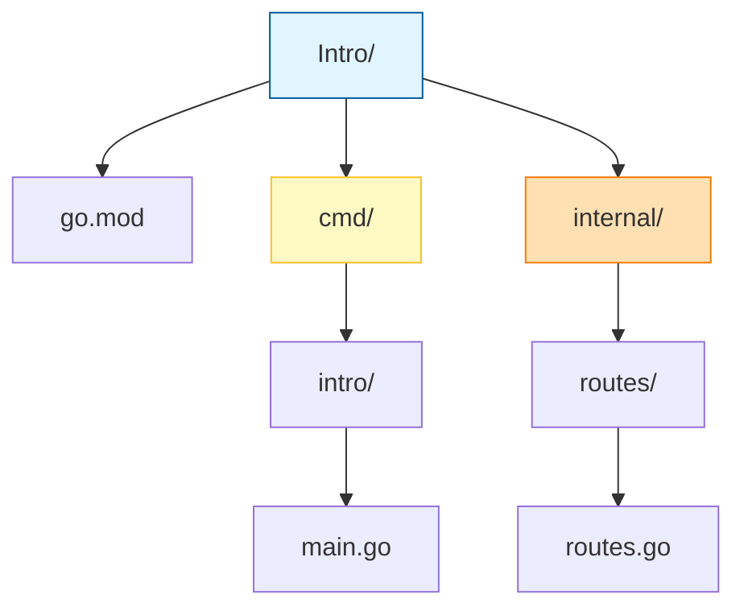

# Go Journey

Welcome to my Go programming repository. This "book" documents my journey of learning Go (Golang) through practical projects. Each chapter dives into a specific project, explaining the concepts, code, and logic behind it.

## Index

*   [**Chapter 1: Intro**](./Intro) - A basic HTTP server implementation using the standard library.

---

## Chapter 1: Intro

### Overview
The **Intro** project is a practical guide to setting up a "proper" Go workspace. Rather than just writing a single `main.go` file, this project demonstrates the **standard project layout** preferred by the Go community. It covers how to initialize a module, organize code into packages, and structure your folders for scalability.

### Key Concepts
1.  **Go Modules (`go.mod`)**: The `go.mod` file defines the module's path and dependencies. It allows you to manage versions and imports reliably.
2.  **Standard Directory Layout**:
    *   **`cmd/`**: Contains the main entry point(s) of the application. The directory name usually matches the desired name of the executable (e.g., `cmd/intro` builds to `intro.exe`).
    *   **`internal/`**: Contains private application code. Go's toolchain enforces that code inside `internal` cannot be imported by external modules, ensuring better encapsulation.
3.  **Packages**: In Go, every folder is a package. All files within a single folder must belong to the same package.

### Folder Structure
Authentication of a clean Go project looks like this:



### Code & Structure Walkthrough

#### 1. The Module Definition (`go.mod`)
Created by running `go mod init github.com/priyanshu-samal/intro`. This file marks the root of the project and tracks the Go version (e.g., `go 1.22.5`).

#### 2. The Entry Point (`cmd/intro/main.go`)
This is the "face" of the application. It belongs to `package main`, which tells the Go compiler that this file should compile into an executable program.
```go
package main

import (
    "github.com/priyanshu-samal/Intro/internal/routes" // Importing our internal package
)

func main() {
    router := routes.NewRouter() // Using logic from the internal package
    // ... server startup logic ...
}
```

#### 3. The Logic Package (`internal/routes/routes.go`)
This file belongs to `package routes`. By placing it in `internal/`, we clearly signal that this logic is specific to our `Intro` application.
```go
package routes // Declares the package name

func NewRouter() *http.ServeMux {
    // ... routing implementations ...
}
```

### How Wait Works
*   **Running**: When you run `go run cmd/intro/main.go`, Go compiles the `main` package and links it with the imported `routes` package.
*   **Building**: Running `go build -o bin/intro.exe ./cmd/intro` would create a binary in a `bin` folder.

---
*Happy Coding!*
